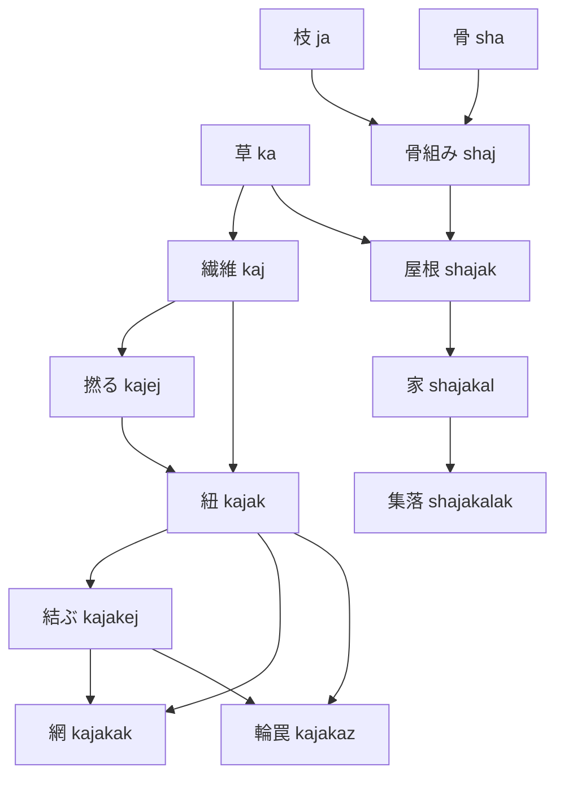

# 語彙系統樹 — 試作02

状態：未採用。83見出し候補（原始語根11＋拡張候補72）。

枝は**意味・語形成の系譜**で、言語の系統分類ではない。複合語は複数の親を持つため、厳密には合流のある有向グラフ。ここでは主な親の下に一度だけ置き、他の親を「＋」で示す。追加の親を含む全辺はJSONに保存している。

[語義・語源・生活場面の一覧](../drafts/002-living-vocabulary.md)／[構造化データ](draft-v0.1.json)

## 骨の系列

```text
sha /ʃa/ — 骨
```

## 木炭の系列

```text
m /m̩/ — 木炭
└─ zam /zam/ — 炭粉・黒い顔料 ［＋石］
   └─ zamej /zameɟ/ — 描く・印を付ける
      └─ zamejoj /zameɟoɟ/ — 図・印
         └─ zamejojak /zameɟoɟag/ — 記録 ［＋分け前］
```

## 血の系列

```text
va /va/ — 血
├─ vej /veɟ/ — 出血する
├─ vaz /vaz/ — 血の塊・凝血 ［＋石］ ＊
│  └─ vazej /vazeɟ/ — 凝固する（血が）
└─ vak /vak/ — 傷の覆い・当て草 ［＋草］ ＊
   └─ vakej /vakeɟ/ — 傷を手当てする
```

## 果実の系列

```text
cha /tʃa/ — 果実
├─ chaj /tʃaɟ/ — 種
│  ├─ chajej /tʃaɟeɟ/ — 播く
│  └─ chajal /tʃaɟaɭ/ — 畑・播種地 ［＋播く］
├─ chej /tʃeɟ/ — 食べる
└─ chak /tʃag/ — 収穫物 ［＋採り集める］
   └─ chakaj /tʃagaɟ/ — 分け前
      └─ chakajej /tʃagaɟeɟ/ — 分配する
```

## 草の系列

```text
ka /ka/ — 草
├─ kaj /kaɟ/ — 繊維
│  ├─ kajej /kaɟeɟ/ — 撚る
│  ├─ kajak /kaɟag/ — 紐・縄 ［＋撚る］
│  │  ├─ kajakej /kaɟageɟ/ — 結ぶ・縛る
│  │  ├─ kajakaz /kaɟagaʐ/ — 輪罠 ［＋結ぶ・縛る］
│  │  └─ kajakak /kaɟagag/ — 網 ［＋結ぶ・縛る］
│  └─ jakaj /ʝakaɟ/ — 籠 ［＋木の枝］ ＊
│     └─ jakajej /ʝakaɟeɟ/ — 採り集める
└─ kal /kaɭ/ — 草地
```

## 空の系列

```text
l /l̩/ — 空
├─ lam /lam/ — 雨雲・雲 ［＋木炭］ ＊
│  └─ lamov /lamow/ — 雨
│     ├─ lamovaj /lamowaɟ/ — 雨粒・滴
│     └─ lamovak /lamowag/ — 水 ＊
│        ├─ lamovakej /lamowageɟ/ — 飲む
│        ├─ lamovakal /lamowagaɭ/ — 水場
│        └─ lamovakov /lamowagow/ — 流れ・小川 ＊
└─ laz /laz/ — 雹 ［＋石］
```

## 木の枝の系列

```text
ja /ʝa/ — 木の枝
├─ jaj /ʝaɟ/ — 小枝
├─ jak /ʝag/ — 藪
└─ shaj /ʃaʝ/ — 骨組み ［＋骨］
   ├─ shajej /ʃaʝeɟ/ — 組み立てる
   ├─ shajak /ʃaʝak/ — 草葺き・屋根 ［＋草］
   │  └─ shajakal /ʃaʝakaɭ/ — 家・住居
   │     └─ shajakalak /ʃaʝakaɭag/ — 集落
   └─ lamovakshaj /lamowagaʃaʝ/ — 橋 ［＋水］
```

## 花の系列

```text
tha /θa/ — 花
├─ thov /θow/ — 香り
│  └─ thovej /θoweɟ/ — 嗅ぐ
└─ thak /θag/ — 花束 ［＋結ぶ・縛る］
```

## 肉の系列

```text
ta /ta/ — 肉
├─ vat /vat/ — 身体・体 ［＋血］
│  ├─ javat /ʝavat/ — 腕・前肢 ［＋木の枝］ ＊
│  │  └─ javataj /ʝavataɟ/ — 手
│  │     └─ javatajej /ʝavataɟeɟ/ — 掴む
│  └─ shavat /ʃavat/ — 骨格 ［＋骨］
└─ tej /teɟ/ — 解体する（獲物を）
```

## 火打石の系列

```text
n /n̩/ — 火打石
├─ nam /nam/ — 火 ［＋木炭］ ＊
│  ├─ namaj /namaɟ/ — 熾火
│  ├─ namej /nameɟ/ — 燃える・燃やす
│  │  └─ namejoj /nameɟoɟ/ — 灰
│  ├─ namal /namaɭ/ — 炉・火床
│  │  └─ namalvatak /namaɭavatag/ — 世帯・同じ炉で暮らす人々 ［＋身体・体］ ＊
│  ├─ namat /namat/ — 焼き肉 ［＋肉］
│  │  └─ namatej /namateɟ/ — 焼く（食物を）
│  └─ kanam /kanam/ — 煙 ［＋草］ ＊
│     ├─ kanamej /kanameɟ/ — 燻す
│     └─ kanamat /kanamat/ — 燻製肉 ［＋肉］
└─ naj /naɟ/ — 刃・刃片
   ├─ najej /naɟeɟ/ — 切る
   ├─ najaz /naɟaʐ/ — 小刀
   └─ najav /naɟav/ — 切り傷 ［＋血］
```

## 石の系列

```text
za /za/ — 石
├─ zaj /zaɟ/ — 石片
├─ zaz /zaʐ/ — 槌・打ち石
├─ jaz /ʝaz/ — 臼 ［＋木の枝］ ＊
│  └─ jazej /ʝazeɟ/ — 搗く・突き砕く
└─ chaz /tʃaz/ — 磨り石 ［＋果実・種］
   └─ chazej /tʃazeɟ/ — 磨り潰す
      └─ chazejoj /tʃazeɟoɟ/ — 粉（種実を挽いた粉） ［＋種］
```

＊＝語源に特に検討が必要な案。印のない拡張語も未採用。

## 合流が重要な例



