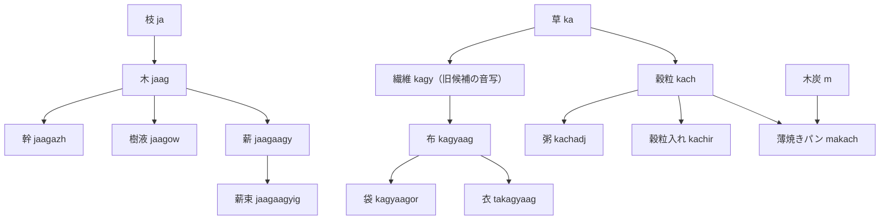

# 語彙系統樹 — 試作05

90語追加・13見出し見直し、計103見出し候補。個別の形・意味・短縮規則は未採用。

合流のある意味系統を、主な親からの枝として表示する。複合や作業には複数の親があり、追加の寄与を「＋」で示す。必要な旧候補だけを参照ノードとして残した。**［旧候補参照］は旧試作の意味の足場であり、その語形・接辞を一括採用したという意味ではない。** 試作版の親子参照と実際の音変化の歴史は、語源欄・音変化欄で区別する。

[語義・構成・用途の一覧](../drafts/005-short-living-vocabulary.md)／[構造化データ](extension-v0.2.json)

## 骨の系列

```text
sha /ʃa/ — 骨 ［旧候補参照］
├─ shan /ʃan/ — 錐・穿孔用の骨尖 ＋火打石
├─ shak /ʃak/ — 縫い針 ＋草・繊維
└─ shav /ʃav/ — 傷のかさぶた ＋血・血の塊・凝血
```

## 木炭の系列

```text
m /m̩/ — 木炭 ［旧候補参照］
└─ makach /makatʃ/ — 焼き餅・薄焼きパン ＋穀粒・粉（種実を挽いた粉）・水
```

## 血の系列

```text
va /va/ — 血 ［旧候補参照］
├─ vaz /vaz/ — 血の塊・凝血 ［旧候補参照］ ＋石
├─ vew /vew/ — 血が流れる
├─ veew /veːw/ — 血を流出させる
└─ vakat /vakat/ — 傷に当てる葉 ＋葉
```

## 果実の系列

```text
cha /tʃa/ — 果実 ［旧候補参照］
├─ chaj /tʃaɟ/ — 種 ［旧候補参照］
│  └─ chagyir /tʃaɟiʐ/ — 播種用の種入れ
├─ chiigy /tʃiːɟ/ — 分け前
├─ cheegy /tʃeːɟ/ — 食物を配る
├─ chadj /tʃadʒ/ — 食物・用意した食べ物 ＋肉
│  ├─ chadjedj /tʃadʒedʒ/ — 食べる
│  ├─ chadjeedj /tʃadʒeːdʒ/ — 食物を与える
│  │  └─ chadjeedjiw /tʃadʒeːdʒiw/ — 食物を配膳する人
│  └─ chadjir /tʃadʒiʐ/ — 食物入れ
├─ cheeg /tʃeːg/ — 実を採り集める
├─ chak /tʃak/ — 穀草・実を食用に採る草 ＋草
│  └─ chakig /tʃakig/ — 穀草の束
├─ chat /tʃat/ — 果肉 ＋肉
│  ├─ chatadj /tʃatadʒ/ — 果実粥・果肉の練り食
│  └─ chatow /tʃatow/ — 果汁
│     ├─ chatowidj /tʃatowidʒ/ — 果汁を飲む
│     ├─ chatowir /tʃatowiʐ/ — 果汁入れ
│     ├─ chatowew /tʃatowew/ — 果汁が流れる
│     └─ chatoweew /tʃatoweːw/ — 果汁を注ぐ
└─ cham /tʃam/ — 炒り種実 ＋木炭
```

## 草の系列

```text
ka /ka/ — 草 ［旧候補参照］
├─ kaj /kaɟ/ — 繊維 ［旧候補参照］
│  ├─ kajej /kaɟeɟ/ — 撚る ［旧候補参照］
│  ├─ kajak /kaɟag/ — 紐・縄 ［旧候補参照］ ＋撚る
│  │  └─ kagyagaag /kaɟagaːg/ — 網
│  ├─ kagyig /kaɟig/ — 繊維束
│  └─ kagyaag /kaɟaːg/ — 織地・布
│     └─ kagyaagor /kaɟaːgoʐ/ — 布袋
├─ keeg /keːg/ — 草材を集める
├─ kat /kat/ — 葉 ＋肉
│  ├─ katig /katig/ — 葉束
│  ├─ kator /katoʐ/ — 葉包み
│  └─ kateeg /kateːg/ — 葉を摘み集める
├─ kach /katʃ/ — 穀粒 ＋果実
│  ├─ kachir /katʃiʐ/ — 穀粒入れ
│  └─ kachadj /katʃadʒ/ — 粥 ＋水・火
└─ kaj /kaʝ/ — 枝草の壁・目隠し ＋木の枝
```

## 空の系列

```text
l /l̩/ — 空 ［旧候補参照］
└─ lam /lam/ — 雨雲・雲 ［旧候補参照］ ＋木炭
   └─ lamov /lamow/ — 雨 ［旧候補参照］
      ├─ lamovaj /lamowaɟ/ — 雨粒・滴 ［旧候補参照］
      │  └─ lamoogy /lamoːɟ/ — 雨粒・滴
      └─ lamovak /lamowag/ — 水 ［旧候補参照］
         └─ lamoog /lamoːg/ — 水
            ├─ lamoogshaj /lamoːgʃaʝ/ — 橋 ＋骨組み
            ├─ lamoogew /lamoːgew/ — 水が流れる
            ├─ lamoogeew /lamoːgeːw/ — 水を流す・注ぐ
            ├─ lamoogir /lamoːgiʐ/ — 水入れ・水容器
            ├─ lamoogak /lamoːgak/ — 湿地・水の溜まる草地 ＋草
            ├─ lamoogow /lamoːgow/ — 小川・水の流れ
            ├─ lamoogidj /lamoːgidʒ/ — 水を飲む；飲む
            └─ lamoogiidj /lamoːgiːdʒ/ — 水を飲ませる
```

## 木の枝の系列

```text
ja /ʝa/ — 木の枝 ［旧候補参照］
├─ shaj /ʃaʝ/ — 骨組み ［旧候補参照］ ＋骨
│  └─ shajak /ʃaʝak/ — 草葺き・屋根 ［旧候補参照］ ＋草
│     └─ shajak /ʃaʝak/ — 屋根；屋根付きの住まい
├─ jaag /ʝaːg/ — 木・幹を持つ樹木
│  ├─ jaagag /ʝaːgag/ — 林
│  ├─ jaagazh /ʝaːgaʒ/ — 幹
│  ├─ jaagow /ʝaːgow/ — 樹液
│  ├─ jaagaagy /ʝaːgaːɟ/ — 薪 ＋火
│  │  └─ jaagaagyig /ʝaːgaːɟig/ — 薪束
│  └─ jaagegy /ʝaːgeɟ/ — 木を割る
│     └─ jaagegyogy /ʝaːgeɟoɟ/ — 割り材
├─ jig /ʝig/ — 枝束
├─ jor /ʝoʐ/ — 木製品
├─ jeeg /ʝeːg/ — 枝を拾い集める
├─ jan /ʝan/ — 削る・枝を削る ＋火打石
│  ├─ janar /ʝanaʐ/ — 削り小刀
│  ├─ janogy /ʝanoɟ/ — 削り材
│  └─ janoogy /ʝanoːɟ/ — 削りくず
├─ jat /ʝat/ — 担ぎ棒；担ぐ ＋肉
│  └─ jatiw /ʝatiw/ — 担ぎ手
├─ jash /ʝaʃ/ — 杭 ＋骨
├─ jak /ʝak/ — 敷き物・草の寝敷き ＋草
│  └─ jakvat /ʝakvat/ — 寝床；横たわる ＋身体・体
├─ jezh /ʝeʒ/ — 枝を支える
│  └─ jezhar /ʝeʒaʐ/ — 枝を支える支柱
└─ jal /ʝal/ — 分岐点 ＋空・道；道を辿って進む
```

## 花の系列

```text
tha /θa/ — 花 ［旧候補参照］
├─ thov /θow/ — 香り ［旧候補参照］
│  └─ thowir /θowiʐ/ — 香りを留める小袋・器
├─ thig /θig/ — 花を束ねた一単位
└─ theeg /θeːg/ — 花を摘み集める
```

## 肉の系列

```text
ta /ta/ — 肉 ［旧候補参照］
├─ vat /vat/ — 身体・体 ［旧候補参照］ ＋血
│  └─ vatag /vatag/ — 群れ・連れ立つ一団
├─ tegy /teɟ/ — 肉を切り分ける・獲物を解体する
├─ takagyaag /takaɟaːg/ — 衣・身に着ける布 ＋織地・布
├─ tadj /tadʒ/ — 肉を主材にした食物
├─ tedj /tedʒ/ — 肉を食べる
├─ teedj /teːdʒ/ — 肉を食物として与える
└─ tir /tiʐ/ — 肉入れ
```

## 火打石の系列

```text
n /n̩/ — 火打石 ［旧候補参照］
├─ nam /nam/ — 火 ［旧候補参照］ ＋木炭
│  ├─ namaz /namaz/ — 石囲いの炉 ＋石
│  └─ namavat /namavat/ — 同じ火を共にする生活集団 ＋身体・体
└─ nak /nak/ — 草を刈る ＋草
   ├─ nakar /nakaʐ/ — 草刈り刃
   └─ nakiw /nakiw/ — 草を刈る人
```

## 石の系列

```text
za /za/ — 石 ［旧候補参照］
├─ chaz /tʃaz/ — 磨り石 ［旧候補参照］ ＋果実・種
│  └─ chazej /tʃazeɟ/ — 磨り潰す ［旧候補参照］
│     └─ chazejoj /tʃazeɟoɟ/ — 粉（種実を挽いた粉） ［旧候補参照］ ＋種
├─ zeeg /zeːg/ — 石を拾い集める
├─ zach /zatʃ/ — 堅果・殻を割って食べる実 ＋果実
├─ zegy /zeɟ/ — 石を割る
│  ├─ zegyar /zeɟaʐ/ — 石割り槌
│  ├─ zegyogy /zeɟoɟ/ — 割り石
│  ├─ zegyoogy /zeɟoːɟ/ — 石くず
│  └─ zegyaar /zeɟaːʐ/ — 石割り台・設備
├─ zor /zoʐ/ — 石製品
├─ zash /zaʃ/ — 岩盤・露出した岩棚 ＋骨
├─ zan /zan/ — 打つ・叩く ＋火打石
│  ├─ zanar /zanaʐ/ — 叩く槌
│  └─ zaniw /zaniw/ — 打撃作業をする人
├─ zat /zat/ — 肉切り台 ＋肉
└─ zaj /zaʝ/ — 道；道を辿って進む ＋木の枝
   └─ zajigy /zaʝiɟ/ — 脇道
```

## 新しい生活場面から見る枝

以下は主な枝を抜き出した図。合流する材料・作業は本文の全系統とデータで追える。



## 長くなるものは句へ

『同じ炉で暮らす人々に果汁を配る係』などは、生活集団・果汁・供与・担い手を全て連結した見出しにしない。句の設計で表す対象として保留する。まだ統語文法を定めていないため、ここでは人工言語の完成した句としては提示しない。

